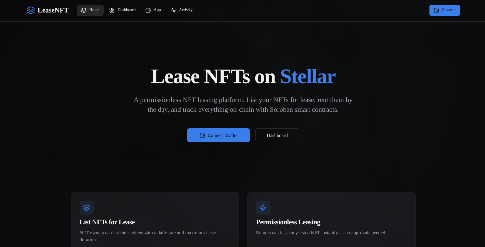
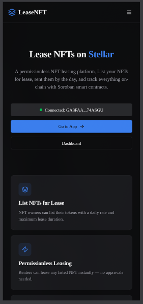
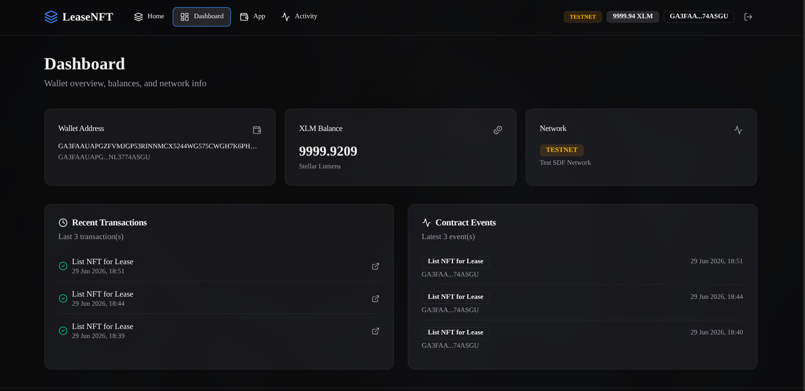
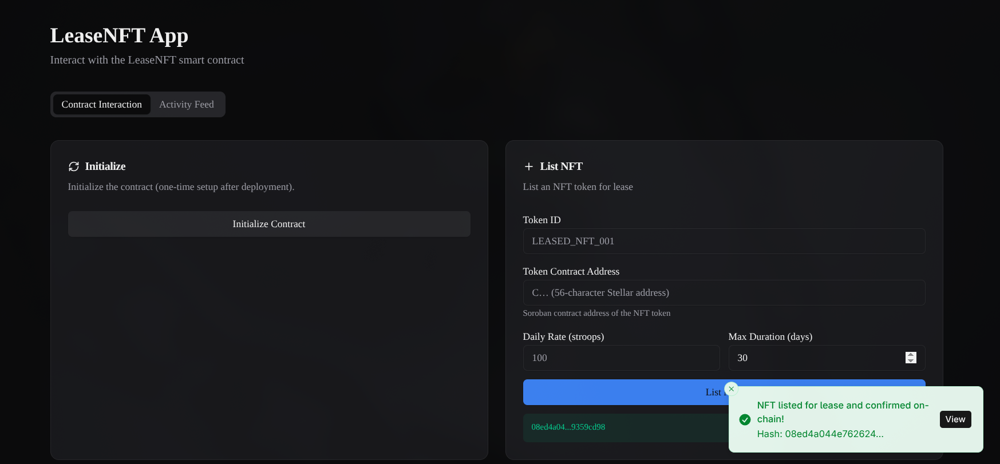
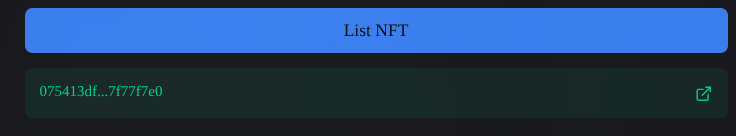
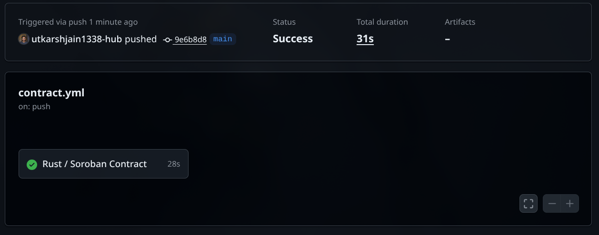
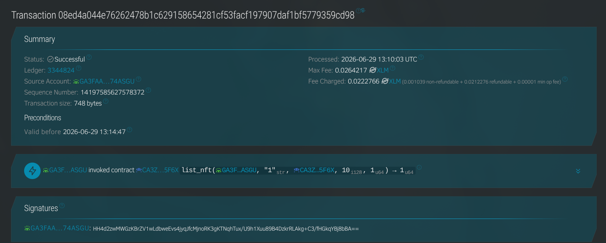
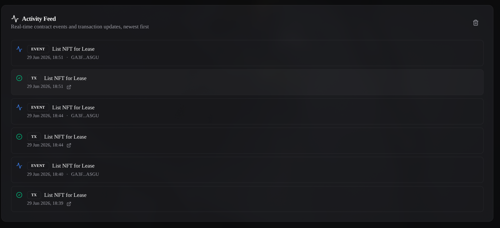
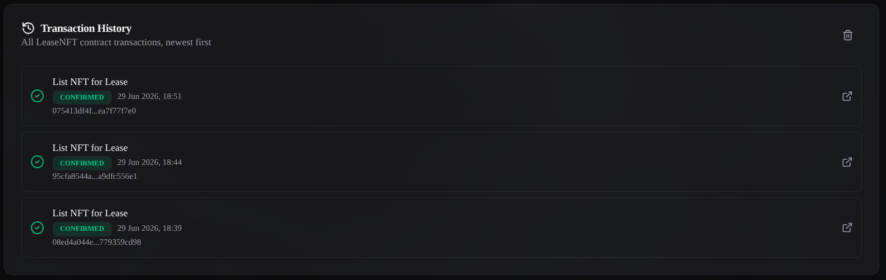

# LeaseNFT — NFT Leasing Platform on Stellar Soroban

> A production-grade, permissionless NFT leasing dApp built with Rust/Soroban smart contracts and a Next.js frontend. Built for the Stellar Orange Belt certification.

[](https://github.com/utkarshjain1338-hub/LeaseNFT/actions/workflows/contract.yml)
[](https://github.com/utkarshjain1338-hub/LeaseNFT/actions/workflows/frontend.yml)

---

## Live Demo

> **Testnet Contract**: `CCXXX...` (see `client/.env` after deployment)
> **Network**: Stellar Testnet

---

## Features

### Smart Contracts (Rust / Soroban v25)

| Contract | Description |
|----------|-------------|
| **LeaseNFT** | Core listing, leasing, and lifecycle management |
| **Treasury** | Fee collection via cross-contract invocation |

**LeaseNFT functions**: `init` · `list_nft` · `lease_nft` · `end_lease` · `get_listing` · `get_lease` · `get_listing_count` · `get_treasury`

**Treasury functions**: `init` · `deposit_fee` · `withdraw` · `get_balance` · `get_admin`

**Inter-contract communication**: `lease_nft()` calls `Treasury.deposit_fee()` via Soroban cross-contract invocation.

### Frontend (Next.js 16 / TypeScript / Tailwind v4)

- Wallet connection via Stellar Wallets Kit (Freighter, Albedo, LOBSTR, WalletConnect)
- Real-time activity feed with cursor-based event streaming
- Automatic listing discovery (scans all on-chain listings)
- Dark mode, skeleton loaders, toast notifications
- Mobile-responsive layout with proper touch targets
- Typed error classes mapped from Soroban errors
- Zod environment validation with fail-fast errors

---

## Architecture

```
LeaseNFT Contract ──cross-contract──► Treasury Contract
       │                                    │
       │ events                             │ events
       ▼                                    ▼
Soroban RPC (getEvents)              Soroban RPC
       │
       ▼ incremental polling (10s cursor)
eventService.ts
       │
       ▼
Zustand eventStore → ActivityFeed UI
```

See [docs/architecture.md](docs/architecture.md) for the full system diagram.

---

## Contract Addresses (Testnet)

LeaseNFT Contract:
CAK2667O5DDJTDLCAMCR4OOUG6DCA4BCOLFRWRDBF5RIPYM2BVTG5KSD

Treasury Contract:
CAOR34Q7QMWJV4HANB62BX47ABNK2C4FB7HRDLYZ22Y253K557UKBD2J

---

## Sample Transaction

Listing Created

Hash:
7bacbedd57c0cd118380eb58842d31be22540a504cd867ec7470389c4356e1e1

---

## Quick Start

### Prerequisites

- Rust + `wasm32-unknown-unknown` target
- [Stellar CLI](https://developers.stellar.org/docs/tools/stellar-cli)
- Node.js / [Bun](https://bun.sh)

### 1. Clone & Install

```bash
git clone https://github.com/yourusername/LeaseNFT.git
cd LeaseNFT
cd client && bun install
```

### 2. Deploy Contracts

```bash
export STELLAR_SECRET_KEY=SXXXXXXXXXX

# Optional: deploy Treasury first
bash scripts/deploy_treasury.sh
#or
stellar contract deploy \                   
 --wasm target/wasm32v1-none/release/treasury.wasm \
 --source dev \
 --network testnet

# Deploy LeaseNFT (with treasury)
bash scripts/deploy_contract.sh --treasury <TREASURY_ID>

#or
stellar contract deploy \                                 
--wasm target/wasm32v1-none/release/lease_nft.wasm \
--source dev \
--network testnet
```

### 3. Run Frontend

```bash
cd client
bun run dev
```

Open [http://localhost:3000](http://localhost:3000) and connect your wallet.

---

## Contract Tests

```bash
cd contract
cargo test --all
# ✓ 24 LeaseNFT tests + 12 Treasury tests = 36 total
```

Test coverage:

- Full lease lifecycle
- Unauthorized access prevention
- Fee calculation accuracy
- Cross-contract treasury interaction
- Concurrent listings
- Edge cases (min/max values, overflow, re-leasing)

---

## Frontend Tests (Playwright)

```bash
cd client
bunx playwright install chromium
bun run test:e2e
```

Test suites:
- `home.spec.ts` — Landing page, hero, features
- `dashboard.spec.ts` — Activity feed, transaction history
- `listing-form.spec.ts` — Form validation, field presence
- `lease-form.spec.ts` — Connected/disconnected states
- `activity-feed.spec.ts` — Real-time events, mock data

---

## CI/CD

GitHub Actions pipelines in `.github/workflows/`:

| Workflow | Steps |
|----------|-------|
| `contract.yml` | `cargo fmt`, `cargo clippy`, `cargo test`, WASM build |
| `frontend.yml` | `bun install`, `tsc --noEmit`, `eslint`, `next build`, Playwright |
| `ci.yml` | Unified pipeline — fails if either sub-pipeline fails |

---

## Project Structure

```
LeaseNFT/
├── .github/workflows/          # CI/CD
├── contract/
│   └── contracts/
│       ├── contract/src/       # LeaseNFT contract + 24 tests
│       └── treasury/src/       # Treasury contract + 12 tests
├── client/
│   ├── src/
│   │   ├── app/                # Next.js pages
│   │   ├── components/         # UI components
│   │   ├── hooks/              # React hooks
│   │   ├── services/           # Business logic services
│   │   ├── stores/             # Zustand state
│   │   └── lib/                # Stellar, config, errors, env
│   └── tests/e2e/              # Playwright tests
├── scripts/                    # Deployment scripts
└── docs/                       # Documentation
```

---

## Service Layer

The frontend follows a service-layer architecture:

| Service | Responsibility |
|---------|---------------|
| `contractService.ts` | All contract read/write operations |
| `walletService.ts` | Wallet init and address helpers |
| `eventService.ts` | Incremental event polling with cursor |
| `notificationService.ts` | Centralized toast notifications |

Business logic lives in services. Components handle rendering only.

---

## Error Handling

All errors are typed via `src/lib/errors.ts`:

```typescript
TransactionCancelledError
ListingNotFoundError
ListingNotActiveError
DurationExceedsMaxError
UnauthorizedError
WalletNotConnectedError
NetworkMismatchError
NetworkError
WalletSigningError
ContractError
```

`parseContractError(err)` converts any unknown error to a typed class — raw exceptions never reach the UI.

---

## Documentation

| Doc | Description |
|-----|-------------|
| [docs/architecture.md](docs/architecture.md) | System + inter-contract diagrams |
| [docs/deployment.md](docs/deployment.md) | Deploy to testnet/mainnet |
| [docs/testing.md](docs/testing.md) | Run contract + e2e tests |
| [docs/demo-script.md](docs/demo-script.md) | 2-minute demo walkthrough |

---

## Security Considerations

- All contract write functions use `caller.require_auth()` (Soroban authorization)
- Treasury accepts deposits from any caller — for production, restrict to known LeaseNFT contract IDs
- Frontend never handles or stores private keys
- `parseContractError()` sanitizes all errors before UI display
- Zod validates all environment variables at startup

---

## Tech Stack

| Layer | Technology |
|-------|-----------|
| Smart Contracts | Rust, Soroban SDK v25 |
| Frontend | Next.js 16, TypeScript, Tailwind CSS v4 |
| UI Components | shadcn/ui, Radix UI, Lucide Icons |
| State | Zustand + TanStack Query |
| Wallet | Stellar Wallets Kit |
| Tests | cargo test (contracts), Playwright (e2e) |
| CI/CD | GitHub Actions |
| Env Validation | Zod |
| Notifications | Sonner |

---

## 📸 Screenshots

### 🏠 Home Page


### 📱 Mobile Responsive View


### 🔗 Wallet Connected


### 🧾 NFT Listing


### ⚡ Lease Success


### ✅ CI Pipeline


### Stellar Page


### Activity


### Transaction history


---

## 📸 Video DEMO
[Video-Demo](https://drive.google.com/file/d/1K7nQMTwNrAvi63AH0B4eqAQ7KxwF3CnU/view?usp=drivesdk)

---

## License

MIT
